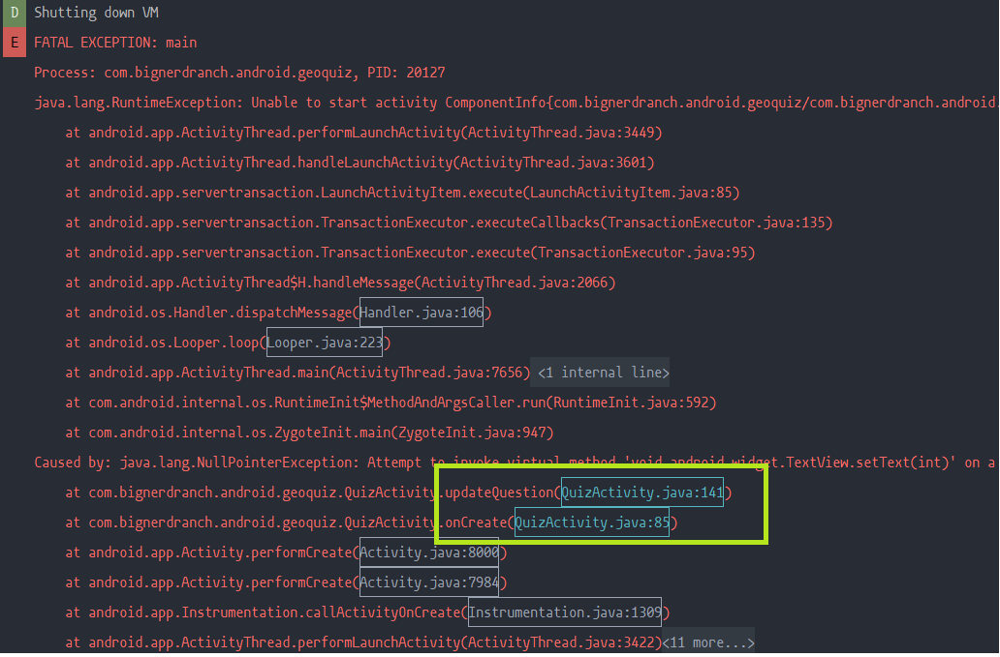
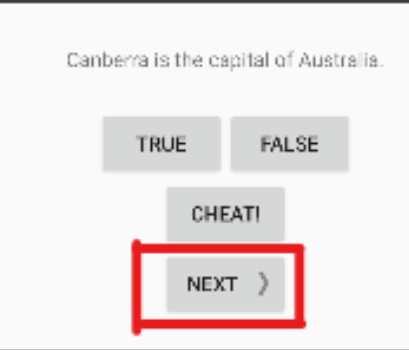
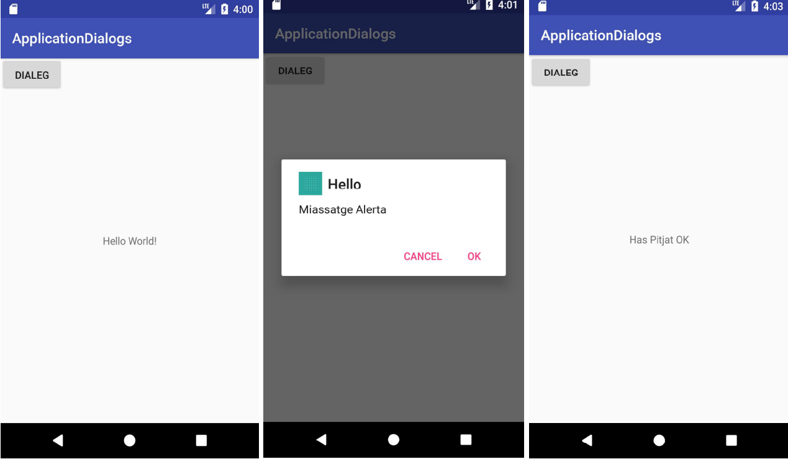
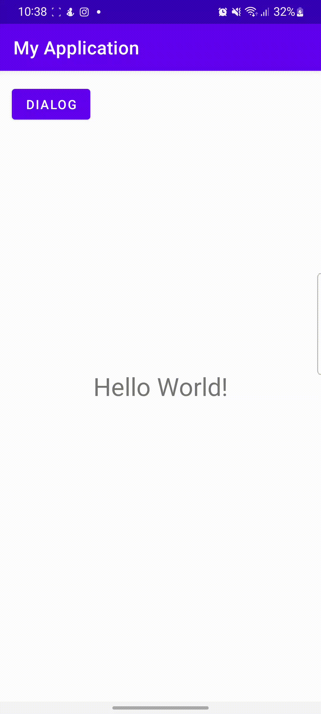

# Debugging Android Apps

## Exercises
<details>

<summary><b>1. Use LogCat console (error messages) to find and correct the error in the GeoQuiz51 project. Insert  <code>Log.d(TAG, " ") </code> messages in your code if you need them.</b> </summary>

If we run the application, and open the LogCat we will find the following. We can see that it indicates some lines that cause the error. We inspect the code:



The code is the following:

```java
mQuestionTextView.setText(question);

updateQuestion();
```

If we go back to the LogCat it does not say that it is caused by the following error:

```java
Caused by: java.lang.NullPointerException: Attempt to invoke virtual method 'void android.widget.TextView.setText(int)'
```

So we can say that the error is the following:

```java
private void updateQuestion() {
	int question = mQuestionBank[mCurrentIndex].getTextResId();
	mQuestionTextView.setText(question);
}
```

`question` has never been initialized, so it is null. A possible solution is this:

```java
private void updateQuestion() {
	int question = mQuestionBank[mCurrentIndex].getTextResId();
	this.mQuestionTextView = this.findViewById(R.id.question_text_view)
	mQuestionTextView.setText(question);
}
```
</details>

<details>

<summary><b>2. Use the Debugger with breakpoints to find and correct the error in the GeoQuiz52 project. Insert <code>Log.d(TAG, " ") </code> messages in your code if you need them. </b> </summary>

Running the application, we noticed that the "next" button did not work. So we proceed to analyze the code:




The code of the button is the following:

```java
mNextButton = (Button) findViewById(R.id.next_button);
mNextButton.setOnClickListener(new View.OnClickListener() {
	@Override
	public void onClick(View v) {
		mCurrentIndex = (mCurrentIndex + 1) % mQuestionBank.length;
		mIsCheater = false;
		
	}
});
```

Using the debugger we notice that the following: the  `updateQuestion()` method is not being used correctly. To solve this problem we must do the following:

```java
mNextButton = (Button) findViewById(R.id.next_button);
mNextButton.setOnClickListener(new View.OnClickListener() {
	@Override
	public void onClick(View v) {
		mCurrentIndex = (mCurrentIndex + 1) % mQuestionBank.length;
		mIsCheater = false;
		updateQuestion();
	}
});
```

</details>

## Extras

---

**Use the documentation in:
https://developer.android.com/guide/topics/ui/dialogsto and https://developer.android.com/reference/android/app/AlertDialog.Builder to create an app like these figures:**



The code for create the dialog is the next: 

```java
    public Dialog creatDialog() {
        tx = (TextView) findViewById(R.id.text_view);
        AlertDialog.Builder builder = new AlertDialog.Builder(this);
        builder.setTitle("Hello");
        builder.setMessage("Message alert");
        builder.setPositiveButton("OK", new DialogInterface.OnClickListener() {
            @Override
            public void onClick(DialogInterface dialogInterface, int i) {
                tx.setText("you have chosen \"OK\"");
            }
        });
        builder.setNegativeButton("CANCEL", new DialogInterface.OnClickListener() {
            @Override
            public void onClick(DialogInterface dialogInterface, int i) {
                tx.setText("you have chosen \"CANCEL\"");
            }
        });
        return builder.create();
    }
```

And the result is the next: 


